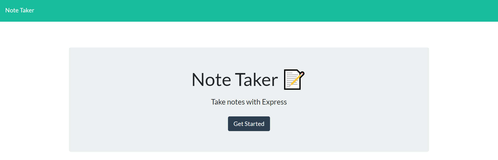

# Note Taker

## Description 
For users that need to keep track of a lot of information, it's easy to forget or be unable to recall something important. Being able to take persistent notes allows users to have written information available when needed.

## User Story

AS A user, I want to be able to write and save notes
I WANT to be able to delete notes I've written before
SO THAT I can organize my thoughts and keep track of tasks I need to complete

### App screenshot

   

## Table of contents

- [Description](#Description)
- [Usage](#Usage)
- [Technologies](#Technologies)
- [Licence](#Licence)
- [Repository Link](#Repository)
- [GitHub Info](#GitHub) 

## Usage

Go to [Note Taker](https://homework10note.herokuapp.com/) 

## Technologies
* HTML
* JavaScript
* Node.js
* Express

## Licence

## Repository

- [Project Repo](https://github.com/morrow7564/Note-Taker)

## GitHub

- Christopher Morrow
- [GitHub Profile](https://github.com/morrow7564)
